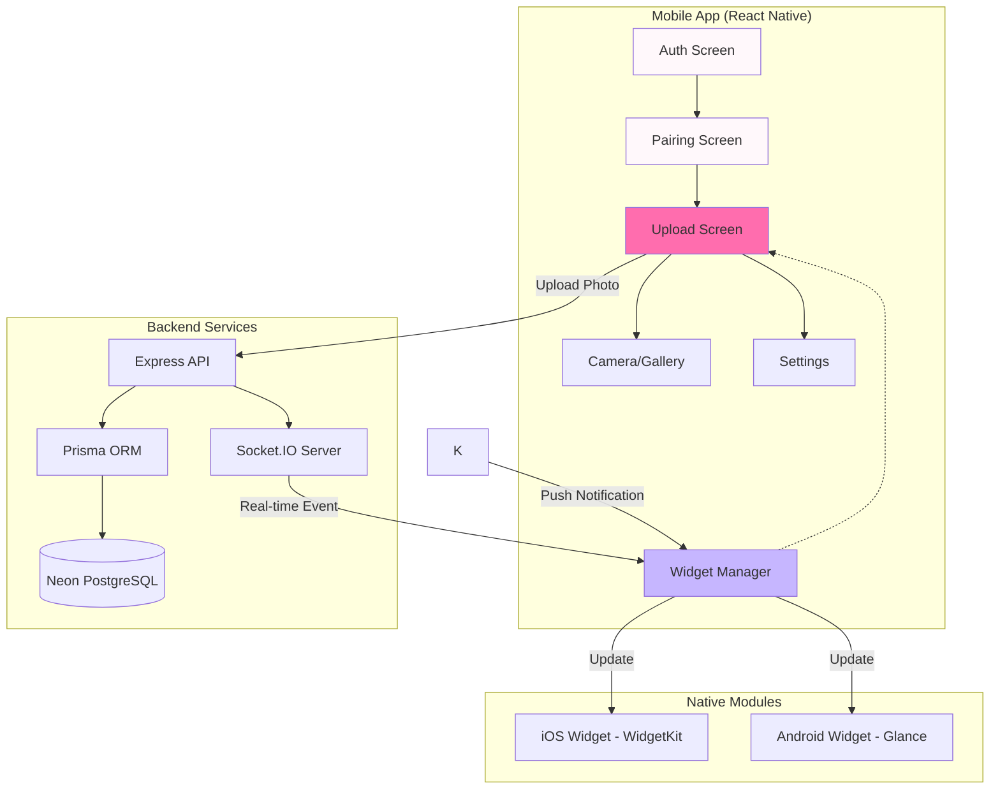
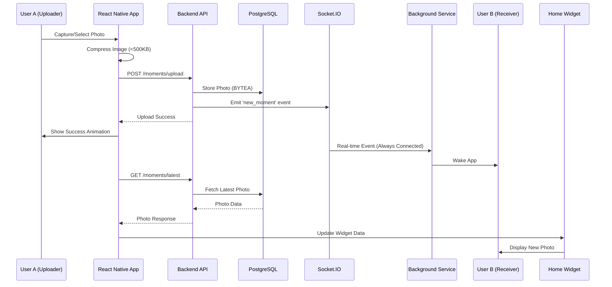

# Pairly Design Document

## Overview

Pairly is a React Native mobile application that creates intimate micro-connections between couples through instant photo sharing and real-time home screen widgets. The architecture prioritizes emotional design, real-time synchronization, privacy, and cross-platform compatibility while maintaining a soft, romantic aesthetic.

### Technology Stack

- **Frontend**: React Native 0.73+ with TypeScript
- **UI Framework**: React Native Paper (customized theme) + React Native Reanimated 3
- **Authentication**: Clerk (Google OAuth)
- **Backend**: Node.js + Express + Socket.IO
- **Database**: Neon PostgreSQL with Prisma ORM
- **Real-time**: Socket.IO for instant photo delivery
- **Background Service**: React Native Background Service (Android) + Background Fetch (iOS)
- **Image Processing**: react-native-image-resizer + Sharp (backend)
- **Widgets**: 
  - iOS: WidgetKit (Swift)
  - Android: Jetpack Glance (Kotlin)
- **Storage**: PostgreSQL BYTEA for photo storage (small, ephemeral)

## Architecture

### High-Level System Architecture



### Data Flow: Photo Upload to Widget Update



## Components and Interfaces

### Frontend Architecture

#### Screen Components

**1. AuthScreen**
```typescript
interface AuthScreenProps {
  onAuthSuccess: (user: User) => void;
}

// Features:
// - Google OAuth button with Clerk
// - Soft gradient background (#FFF8FB to #C6B6FF)
// - Poppins Rounded typography
// - Heart pulse animation on load
```

**2. PairingScreen**
```typescript
interface PairingScreenProps {
  user: User;
  onPairingComplete: (pair: Pair) => void;
}

// Features:
// - Generate invite code button
// - Enter invite code input (6-char alphanumeric)
// - Code display with copy functionality
// - Soft pink accent colors
// - Fade transitions between states
```

**3. UploadScreen** (Main Screen)
```typescript
interface UploadScreenProps {
  user: User;
  pair: Pair;
  onPhotoCapture: (photo: Photo) => void;
}

// Features:
// - Large circular capture button (center)
// - Subtle partner name display (top)
// - Settings icon (top-right)
// - Dreamy background with soft shadows
// - Heart pulse on button press
```

**4. SettingsScreen**
```typescript
interface SettingsScreenProps {
  user: User;
  pair: Pair;
  onDisconnect: () => void;
  onNameChange: (name: string) => void;
}

// Features:
// - Display name editor
// - Disconnect button (with confirmation)
// - Notification preferences
// - About section
// - Soft lavender accents
```

#### Core Services

**PhotoService**
```typescript
interface PhotoService {
  capturePhoto(): Promise<PhotoAsset>;
  selectFromGallery(): Promise<PhotoAsset>;
  compressPhoto(photo: PhotoAsset): Promise<CompressedPhoto>;
  uploadPhoto(photo: CompressedPhoto): Promise<UploadResult>;
}

// Implementation:
// - Uses react-native-image-picker
// - Compression target: <500KB, maintain aspect ratio
// - JPEG quality: 85%
// - Max dimensions: 1080x1920
```

**WidgetService**
```typescript
interface WidgetService {
  updateWidget(photoUrl: string, partnerName: string): Promise<void>;
  getWidgetData(): Promise<WidgetData>;
  clearWidget(): Promise<void>;
}

// Platform-specific implementations:
// - iOS: Uses SharedAppGroup + WidgetKit timeline
// - Android: Uses AppWidgetManager + WorkManager
```

**RealtimeService**
```typescript
interface RealtimeService {
  connect(userId: string): void;
  disconnect(): void;
  onNewMoment(callback: (moment: Moment) => void): void;
  emitMomentUploaded(momentId: string): void;
}

// Implementation:
// - Socket.IO client
// - Auto-reconnect on network restore
// - Event handlers for 'new_moment', 'partner_disconnected'
```

**BackgroundService**
```typescript
interface BackgroundService {
  startService(): Promise<void>;
  stopService(): Promise<void>;
  isRunning(): Promise<boolean>;
  maintainSocketConnection(): void;
}

// Implementation:
// - Android: React Native Background Service (Headless JS)
// - iOS: Background Fetch + Silent Push (minimal)
// - Keeps Socket.IO connection alive 24/7
// - Listens for 'new_moment' events even when app closed
// - Updates widget immediately on event
```

### Backend Architecture

#### API Endpoints

**Authentication**
```typescript
POST /auth/google
// Body: { idToken: string }
// Response: { user: User, token: string }
// Creates or retrieves user from Clerk verification
```

**Pairing**
```typescript
POST /pairs/generate-code
// Headers: Authorization: Bearer <token>
// Response: { code: string, expiresAt: string }

POST /pairs/join
// Body: { code: string }
// Response: { pair: Pair, partner: User }
// Establishes pairing relationship

DELETE /pairs/disconnect
// Headers: Authorization: Bearer <token>
// Response: { success: boolean }
```

**Moments**
```typescript
POST /moments/upload
// Headers: Authorization: Bearer <token>
// Body: FormData { photo: File }
// Response: { moment: Moment, uploadedAt: string }
// Stores photo, emits socket event, sends push notification

GET /moments/latest
// Headers: Authorization: Bearer <token>
// Response: { photo: base64, partnerName: string, sentAt: string }
// Returns current moment for widget display
```

**User**
```typescript
PATCH /users/profile
// Body: { displayName: string }
// Response: { user: User }
```

#### Database Schema (Prisma)

```prisma
model User {
  id            String    @id @default(cuid())
  clerkId       String    @unique
  email         String    @unique
  displayName   String
  photoUrl      String?
  createdAt     DateTime  @default(now())
  updatedAt     DateTime  @updatedAt
  
  // Relationships
  pairAsUser1   Pair?     @relation("User1")
  pairAsUser2   Pair?     @relation("User2")
  uploadedMoments Moment[] @relation("Uploader")
}

model Pair {
  id            String    @id @default(cuid())
  user1Id       String    @unique
  user2Id       String    @unique
  inviteCode    String?   @unique
  codeExpiresAt DateTime?
  pairedAt      DateTime  @default(now())
  
  user1         User      @relation("User1", fields: [user1Id], references: [id])
  user2         User      @relation("User2", fields: [user2Id], references: [id])
  moments       Moment[]
  
  @@index([inviteCode])
}

model Moment {
  id            String    @id @default(cuid())
  pairId        String
  uploaderId    String
  photoData     Bytes     // BYTEA - stores compressed image
  uploadedAt    DateTime  @default(now())
  
  pair          Pair      @relation(fields: [pairId], references: [id], onDelete: Cascade)
  uploader      User      @relation("Uploader", fields: [uploaderId], references: [id])
  
  @@index([pairId, uploadedAt])
}
```

#### Socket.IO Events

**Server Events**
```typescript
// Emitted when partner uploads photo
socket.emit('new_moment', {
  momentId: string,
  uploadedBy: string,
  uploadedAt: string
});

// Emitted when partner disconnects pair
socket.emit('partner_disconnected', {
  reason: string
});

// Emitted when partner changes name
socket.emit('partner_updated', {
  displayName: string
});
```

**Client Events**
```typescript
// Client joins their personal room
socket.emit('join_room', {
  userId: string
});

// Client acknowledges moment receipt
socket.emit('moment_received', {
  momentId: string
});
```

### Native Widget Implementation

#### iOS Widget (WidgetKit)

**Widget Structure**
```swift
struct PairlyWidget: Widget {
    let kind: String = "PairlyWidget"
    
    var body: some WidgetConfiguration {
        StaticConfiguration(kind: kind, provider: Provider()) { entry in
            PairlyWidgetEntryView(entry: entry)
        }
        .configurationDisplayName("Pairly")
        .description("See your partner's latest moment")
        .supportedFamilies([.systemMedium, .systemLarge])
    }
}

struct PairlyWidgetEntry: TimelineEntry {
    let date: Date
    let photoData: Data?
    let partnerName: String
    let hasNewMoment: Bool
}
```

**Update Mechanism**
- Uses App Groups for data sharing between app and widget
- Timeline updates triggered by background fetch
- Reloads widget via `WidgetCenter.shared.reloadTimelines(ofKind:)`

**Design Implementation**
- Soft rounded corners (20pt radius)
- Gradient background (#FFF8FB to #C6B6FF)
- Photo with subtle shadow
- Partner name in Sacramento font
- Heart icon with pulse animation

#### Android Widget (Jetpack Glance)

**Widget Structure**
```kotlin
class PairlyWidget : GlanceAppWidget() {
    override suspend fun provideGlance(context: Context, id: GlanceId) {
        provideContent {
            PairlyWidgetContent()
        }
    }
}

@Composable
fun PairlyWidgetContent() {
    val photoData = currentState<ByteArray?>(key = "photo_data")
    val partnerName = currentState<String>(key = "partner_name")
    
    // Compose UI with Glance components
}
```

**Update Mechanism**
- Uses WorkManager for periodic updates
- Receives updates via BroadcastReceiver from FCM
- Updates widget via `GlanceAppWidgetManager.update()`

**Design Implementation**
- Material 3 theming with custom colors
- Rounded corners (20dp)
- Gradient background
- Photo with elevation
- Custom font loading for romantic typography

## Data Models

### TypeScript Interfaces (Frontend)

```typescript
interface User {
  id: string;
  clerkId: string;
  email: string;
  displayName: string;
  photoUrl?: string;
  createdAt: string;
}

interface Pair {
  id: string;
  user1Id: string;
  user2Id: string;
  inviteCode?: string;
  pairedAt: string;
  partner: User; // Populated partner info
}

interface Moment {
  id: string;
  pairId: string;
  uploaderId: string;
  photoData: string; // base64 encoded
  uploadedAt: string;
}

interface PhotoAsset {
  uri: string;
  type: string;
  fileName: string;
  fileSize: number;
  width: number;
  height: number;
}

interface CompressedPhoto {
  base64: string;
  mimeType: string;
  size: number;
}

interface UploadResult {
  success: boolean;
  momentId?: string;
  error?: string;
}

interface WidgetData {
  photoBase64: string;
  partnerName: string;
  lastUpdated: string;
}
```

## Error Handling

### Error Categories and Strategies

**1. Network Errors**
```typescript
class NetworkError extends Error {
  constructor(message: string, public retryable: boolean) {
    super(message);
  }
}

// Strategy:
// - Auto-retry up to 3 times with exponential backoff
// - Queue photos locally if upload fails
// - Show gentle error message: "Couldn't send right now, we'll try again"
// - Retry when network restored
```

**2. Authentication Errors**
```typescript
class AuthError extends Error {
  constructor(message: string, public code: string) {
    super(message);
  }
}

// Strategy:
// - Clear invalid tokens
// - Redirect to login screen
// - Preserve app state for recovery
// - Show message: "Let's sign in again"
```

**3. Pairing Errors**
```typescript
enum PairingErrorCode {
  INVALID_CODE = 'invalid_code',
  EXPIRED_CODE = 'expired_code',
  ALREADY_PAIRED = 'already_paired',
}

// Strategy:
// - Show specific error messages
// - Allow immediate retry
// - Suggest generating new code if expired
```

**4. Upload Errors**
```typescript
enum UploadErrorCode {
  FILE_TOO_LARGE = 'file_too_large',
  INVALID_FORMAT = 'invalid_format',
  COMPRESSION_FAILED = 'compression_failed',
  NETWORK_TIMEOUT = 'network_timeout',
}

// Strategy:
// - Validate before upload
// - Compress more aggressively if too large
// - Queue for retry on network issues
// - Show progress during upload
```

**5. Widget Errors**
```typescript
// Strategy:
// - Fallback to placeholder if photo load fails
// - Log errors for debugging
// - Retry widget update on next app open
// - Never crash the widget
```

### Error UI Patterns

**Gentle Error Messages**
- "Couldn't connect right now" (network)
- "Let's try that again" (generic retry)
- "This code isn't working" (invalid pairing)
- "Something went wrong, but we saved your moment" (upload queued)

**Visual Error Indicators**
- Soft red tint (#FFE5E5) instead of harsh red
- Subtle shake animation
- Heart icon with bandaid for errors
- Quick fade-out after resolution

## Testing Strategy

### Unit Testing

**Frontend Tests (Jest + React Native Testing Library)**
```typescript
// Test Coverage Areas:
// - PhotoService compression logic
// - RealtimeService connection handling
// - WidgetService data formatting
// - Form validation (pairing code, display name)
// - State management (Redux/Context)

// Example:
describe('PhotoService', () => {
  it('should compress photo to under 500KB', async () => {
    const photo = mockLargePhoto();
    const compressed = await PhotoService.compressPhoto(photo);
    expect(compressed.size).toBeLessThan(500 * 1024);
  });
});
```

**Backend Tests (Jest + Supertest)**
```typescript
// Test Coverage Areas:
// - API endpoint responses
// - Database operations (Prisma)
// - Socket.IO event emissions
// - Authentication middleware
// - Photo storage and retrieval

// Example:
describe('POST /moments/upload', () => {
  it('should store photo and emit socket event', async () => {
    const response = await request(app)
      .post('/moments/upload')
      .set('Authorization', `Bearer ${token}`)
      .attach('photo', photoBuffer);
    
    expect(response.status).toBe(200);
    expect(socketEmitSpy).toHaveBeenCalledWith('new_moment', expect.any(Object));
  });
});
```

### Integration Testing

**End-to-End Flows (Detox)**
```typescript
// Critical User Journeys:
// 1. Complete onboarding flow (auth → pairing → first upload)
// 2. Photo upload and widget update
// 3. Pairing with invite code
// 4. Disconnect and re-pair
// 5. Offline upload with queue

// Example:
describe('Photo Upload Flow', () => {
  it('should upload photo and update partner widget', async () => {
    await device.launchApp();
    await element(by.id('capture-button')).tap();
    await element(by.text('Take Photo')).tap();
    await element(by.id('use-photo')).tap();
    
    await waitFor(element(by.text('Sent ❤️')))
      .toBeVisible()
      .withTimeout(5000);
  });
});
```

### Widget Testing

**iOS Widget Tests (XCTest)**
- Timeline provider logic
- Data loading from App Group
- UI rendering with different states
- Update trigger mechanisms

**Android Widget Tests (Espresso)**
- Glance composable rendering
- WorkManager scheduling
- Broadcast receiver handling
- Data persistence

### Performance Testing

**Metrics to Monitor**
- App launch time: < 2 seconds
- Photo compression time: < 3 seconds
- Upload time (500KB): < 5 seconds on 4G
- Widget update latency: < 3 seconds end-to-end
- Memory usage: < 100MB
- Battery impact: Minimal (background optimizations)

**Tools**
- React Native Performance Monitor
- Flipper for debugging
- Firebase Performance Monitoring
- Custom analytics for upload success rates

### Manual Testing Checklist

**Visual Design Validation**
- [ ] Color palette matches specification
- [ ] Typography (Poppins Rounded, Sacramento) renders correctly
- [ ] Animations are smooth (60fps)
- [ ] Shadows and gradients appear soft and romantic
- [ ] Widget design matches app aesthetic

**Cross-Platform Consistency**
- [ ] iOS and Android UI parity
- [ ] Widget behavior identical on both platforms
- [ ] Notifications work on both platforms
- [ ] Camera/gallery access works correctly

**Edge Cases**
- [ ] Very large photos (>10MB)
- [ ] Poor network conditions
- [ ] Device storage full
- [ ] Rapid successive uploads
- [ ] Partner offline for extended period
- [ ] App killed during upload
- [ ] Widget removed and re-added

## UI/UX Design Specifications

### Color System

```typescript
const theme = {
  colors: {
    primary: '#FF6DAE',        // Soft Pink
    secondary: '#C6B6FF',      // Warm Lavender
    background: '#FFF8FB',     // Cream Background
    surface: '#FFFFFF',
    text: '#2B2B2B',
    textSecondary: '#6B6B6B',
    error: '#FFE5E5',          // Soft error tint
    success: '#E5FFE5',        // Soft success tint
    shadow: 'rgba(43, 43, 43, 0.1)',
  },
  gradients: {
    background: ['#FFF8FB', '#C6B6FF'],
    button: ['#FF6DAE', '#FF8FC4'],
    widget: ['#FFF8FB', '#F5F0FF'],
  },
};
```

### Typography

```typescript
const typography = {
  fonts: {
    primary: 'Poppins-Regular',
    primaryBold: 'Poppins-Bold',
    primaryRounded: 'Poppins-Rounded',
    accent: 'Sacramento-Regular',
    accentAlt: 'Pacifico-Regular',
  },
  sizes: {
    h1: 32,
    h2: 24,
    h3: 20,
    body: 16,
    caption: 14,
    small: 12,
  },
  lineHeights: {
    tight: 1.2,
    normal: 1.5,
    relaxed: 1.8,
  },
};
```

### Spacing System

```typescript
const spacing = {
  xs: 4,
  sm: 8,
  md: 16,
  lg: 24,
  xl: 32,
  xxl: 48,
};
```

### Animation Specifications

```typescript
const animations = {
  durations: {
    fast: 200,
    normal: 300,
    slow: 500,
    fade: 800,
  },
  easings: {
    easeOut: [0.25, 0.1, 0.25, 1],
    easeInOut: [0.42, 0, 0.58, 1],
    spring: { damping: 15, stiffness: 150 },
  },
  effects: {
    heartPulse: {
      scale: [1, 1.1, 1],
      duration: 600,
      easing: 'easeInOut',
    },
    fadeIn: {
      opacity: [0, 1],
      duration: 800,
      easing: 'easeOut',
    },
    slideUp: {
      translateY: [20, 0],
      opacity: [0, 1],
      duration: 400,
      easing: 'easeOut',
    },
  },
};
```

### Component Styling

**Capture Button**
```typescript
const captureButtonStyle = {
  width: 120,
  height: 120,
  borderRadius: 60,
  background: 'linear-gradient(135deg, #FF6DAE, #FF8FC4)',
  shadow: {
    shadowColor: '#FF6DAE',
    shadowOffset: { width: 0, height: 8 },
    shadowOpacity: 0.3,
    shadowRadius: 16,
    elevation: 8,
  },
  pressAnimation: {
    scale: 0.95,
    duration: 100,
  },
};
```

**Widget Design**
```typescript
const widgetStyle = {
  borderRadius: 20,
  padding: 16,
  background: 'linear-gradient(135deg, #FFF8FB, #F5F0FF)',
  photo: {
    borderRadius: 16,
    aspectRatio: 3/4,
    shadow: {
      shadowColor: '#2B2B2B',
      shadowOffset: { width: 0, height: 4 },
      shadowOpacity: 0.1,
      shadowRadius: 12,
    },
  },
  caption: {
    font: 'Sacramento-Regular',
    size: 18,
    color: '#6B6B6B',
    marginTop: 12,
  },
};
```

## Security Considerations

### Authentication Security
- Clerk handles OAuth flow securely
- JWT tokens with short expiration (1 hour)
- Refresh token rotation
- Secure token storage (iOS Keychain, Android Keystore)

### Data Privacy
- Photos stored as BYTEA in PostgreSQL (encrypted at rest)
- No photo URLs or external storage
- Automatic photo deletion on disconnect
- No analytics tracking of photo content

### API Security
- All endpoints require authentication
- Rate limiting on upload endpoints (10 uploads/minute)
- Input validation and sanitization
- CORS configuration for mobile apps only

### Network Security
- HTTPS only for API communication
- TLS 1.3 for Socket.IO connections
- Certificate pinning for production
- Encrypted push notification payloads

## Deployment Architecture

### Backend Deployment
- **Hosting**: Railway or Render
- **Database**: Neon PostgreSQL (serverless)
- **Environment**: Node.js 20 LTS
- **Scaling**: Horizontal scaling with load balancer
- **Monitoring**: Sentry for error tracking

### Mobile App Distribution
- **iOS**: TestFlight (beta) → App Store
- **Android**: Google Play Internal Testing → Production
- **CI/CD**: GitHub Actions for automated builds
- **Code Push**: For minor updates without app store review

### Infrastructure
```yaml
# docker-compose.yml for local development
version: '3.8'
services:
  api:
    build: ./backend
    ports:
      - "3000:3000"
    environment:
      DATABASE_URL: ${DATABASE_URL}
      CLERK_SECRET_KEY: ${CLERK_SECRET_KEY}
    depends_on:
      - postgres
  
  postgres:
    image: postgres:15
    environment:
      POSTGRES_DB: pairly
      POSTGRES_USER: pairly
      POSTGRES_PASSWORD: ${DB_PASSWORD}
    volumes:
      - postgres_data:/var/lib/postgresql/data

volumes:
  postgres_data:
```

## Future Enhancements (Post-MVP)

### Phase 2 Features
- Voice notes (10-second max)
- Doodle/sketch sharing
- Scheduled moments (send later)
- Multiple widget sizes
- Dark mode support

### Phase 3 Features
- Moment reactions (heart, smile)
- Weekly recap (optional)
- Anniversary reminders
- Custom widget themes
- iPad/tablet optimization

### Technical Improvements
- GraphQL API migration
- Redis caching layer
- CDN for photo delivery (if needed)
- Advanced analytics dashboard
- A/B testing framework
