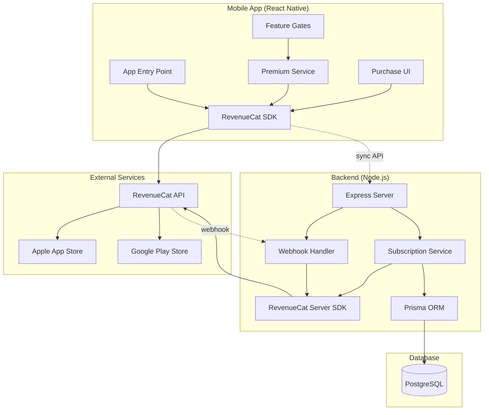

# Design Document: RevenueCat Integration

## Overview

This design describes the integration of RevenueCat subscription management into the Pairly app, replacing the existing mock premium system. The integration spans three layers:

1. **Frontend (React Native + Expo)**: RevenueCat SDK integration for purchase flows and entitlement checks
2. **Backend (Node.js + Express)**: Server-side receipt validation and webhook handling
3. **Database (PostgreSQL + Prisma)**: Subscription state persistence

The design maintains the existing database schema while adding RevenueCat-specific functionality. It ensures subscription status consistency across all layers through a combination of client-side SDK calls, server-side validation, and webhook-driven updates.

### Key Design Principles

- **Server-side validation**: All subscription states are validated on the backend before granting access
- **Graceful degradation**: Offline scenarios use cached subscription data
- **Idempotent operations**: Webhook handlers and sync operations can be safely retried
- **Backward compatibility**: Existing database schema and premium feature gates remain unchanged
- **Security first**: API keys are environment-specific, receipts are validated server-side

## Architecture

### System Components



### Data Flow

**Purchase Flow:**
1. User initiates purchase in App
2. RevenueCat SDK presents native purchase dialog
3. Platform store (Apple/Google) processes payment
4. RevenueCat validates receipt with platform store
5. SDK returns Customer_Info to App
6. App syncs subscription status to Backend
7. Backend validates with RevenueCat and updates Database

**Webhook Flow:**
1. Subscription event occurs (renewal, cancellation, etc.)
2. RevenueCat sends webhook to Backend
3. Backend authenticates webhook signature
4. Backend fetches latest customer info from RevenueCat
5. Backend updates Database with new subscription state
6. Next time App launches, it fetches updated state

**Entitlement Check Flow:**
1. User attempts to access premium feature
2. App checks cached Customer_Info for active entitlement
3. If cache is stale, App fetches fresh Customer_Info
4. App grants or denies access based on entitlement status
5. If denied, App shows paywall

## Components and Interfaces

### Frontend Components

#### 1. RevenueCat Configuration Module

**Purpose**: Initialize and configure the RevenueCat SDK on app startup

**Interface**:
```typescript
interface RevenueCatConfig {
  initialize(apiKey: string, appUserId?: string): Promise<void>
  setUserId(userId: string): Promise<void>
  clearUserId(): Promise<void>
  getCustomerInfo(): Promise<CustomerInfo>
}
```

**Responsibilities**:
- Initialize SDK with platform-specific API key (iOS/Android)
- Set user identity when user logs in
- Clear identity on logout
- Handle initialization errors gracefully

#### 2. Subscription Manager

**Purpose**: Handle all subscription-related operations in the App

**Interface**:
```typescript
interface SubscriptionManager {
  fetchOfferings(): Promise<Offerings>
  purchasePackage(package: Package): Promise<PurchaseResult>
  restorePurchases(): Promise<CustomerInfo>
  getSubscriptionStatus(): Promise<SubscriptionStatus>
  syncWithBackend(customerInfo: CustomerInfo): Promise<void>
}

interface PurchaseResult {
  customerInfo: CustomerInfo
  success: boolean
  error?: PurchaseError
}

interface SubscriptionStatus {
  isPremium: boolean
  plan: 'monthly' | 'yearly' | null
  expiryDate: Date | null
  isInTrial: boolean
}
```

**Responsibilities**:
- Fetch available subscription packages from RevenueCat
- Handle purchase flow and user interactions
- Restore purchases on new devices
- Sync subscription status with backend
- Transform RevenueCat CustomerInfo into app-specific SubscriptionStatus

#### 3. Entitlement Manager

**Purpose**: Check premium feature access and manage feature gates

**Interface**:
```typescript
interface EntitlementManager {
  hasAccess(feature: PremiumFeature): Promise<boolean>
  checkEntitlement(entitlementId: string): Promise<boolean>
  getCachedStatus(): SubscriptionStatus | null
  refreshEntitlements(): Promise<void>
}

enum PremiumFeature {
  UNLIMITED_MOMENTS = 'unlimited_moments',
  LOVE_NOTES = 'love_notes',
  TIME_LOCK = 'time_lock',
  DUAL_CAMERA = 'dual_camera',
  LIVE_PRESENCE = 'live_presence',
  SECRET_VAULT = 'secret_vault',
  DARK_MODE = 'dark_mode',
  THEMES = 'themes',
  APP_LOCK = 'app_lock',
  SMART_REMINDERS = 'smart_reminders'
}
```

**Responsibilities**:
- Check if user has access to specific premium features
- Cache entitlement status for offline access
- Refresh entitlements when app comes online
- Provide synchronous access to cached status for UI rendering

#### 4. Purchase UI Components

**Purpose**: Display subscription plans and handle purchase interactions

**Components**:
- `PaywallScreen`: Full-screen subscription offering display
- `SubscriptionCard`: Individual plan display (monthly/yearly)
- `PurchaseButton`: Handles purchase initiation
- `RestorePurchasesButton`: Triggers restore flow
- `SubscriptionStatusBadge`: Shows current subscription state

**Key Behaviors**:
- Display pricing from RevenueCat offerings (localized)
- Show trial information prominently
- Handle loading states during purchase
- Display error messages for failed purchases
- Show success confirmation after purchase

### Backend Components

#### 1. Webhook Handler

**Purpose**: Receive and process RevenueCat webhook events

**Interface**:
```typescript
interface WebhookHandler {
  handleWebhook(req: Request, res: Response): Promise<void>
  verifyWebhookSignature(req: Request): boolean
  processEvent(event: WebhookEvent): Promise<void>
}

interface WebhookEvent {
  type: 'INITIAL_PURCHASE' | 'RENEWAL' | 'CANCELLATION' | 'EXPIRATION' | 'BILLING_ISSUE' | 'UNCANCELLATION'
  app_user_id: string
  product_id: string
  event_timestamp_ms: number
  expiration_at_ms: number | null
}
```

**Responsibilities**:
- Authenticate webhook requests using RevenueCat signature
- Parse webhook payload and extract event data
- Route events to appropriate handlers
- Update database based on event type
- Return appropriate HTTP status codes for retry logic
- Log all webhook events for debugging

**Event Handlers**:
- `INITIAL_PURCHASE`: Set isPremium=true, store plan and expiry
- `RENEWAL`: Update premiumExpiry date
- `CANCELLATION`: Keep isPremium=true until expiry (no immediate change)
- `EXPIRATION`: Set isPremium=false
- `BILLING_ISSUE`: Log issue, maintain access during grace period
- `UNCANCELLATION`: Update expiry if user resubscribes

#### 2. Subscription Service

**Purpose**: Server-side subscription management and validation

**Interface**:
```typescript
interface SubscriptionService {
  validateSubscription(userId: string): Promise<SubscriptionData>
  syncUserSubscription(userId: string, customerInfo: CustomerInfo): Promise<void>
  getSubscriptionStatus(userId: string): Promise<SubscriptionStatus>
  revokeAccess(userId: string): Promise<void>
  grantAccess(userId: string, plan: string, expiryDate: Date): Promise<void>
}

interface SubscriptionData {
  isValid: boolean
  plan: string | null
  expiryDate: Date | null
  revenueCatId: string
}
```

**Responsibilities**:
- Validate subscription status with RevenueCat API
- Sync subscription data to database
- Provide subscription status to other backend services
- Handle subscription state transitions
- Manage database updates through Prisma

#### 3. RevenueCat API Client

**Purpose**: Wrapper around RevenueCat Node.js SDK for server-side operations

**Interface**:
```typescript
interface RevenueCatClient {
  getSubscriberInfo(appUserId: string): Promise<SubscriberInfo>
  grantPromotionalEntitlement(appUserId: string, entitlementId: string, duration: number): Promise<void>
  deleteSubscriber(appUserId: string): Promise<void>
}
```

**Responsibilities**:
- Initialize RevenueCat SDK with secret API key
- Fetch subscriber information from RevenueCat
- Handle API errors and retries
- Provide typed interfaces for RevenueCat responses

#### 4. Migration Service

**Purpose**: Migrate existing premium users from mock system to RevenueCat

**Interface**:
```typescript
interface MigrationService {
  identifyLegacyUsers(): Promise<User[]>
  flagUserForMigration(userId: string): Promise<void>
  completeMigration(userId: string, revenueCatId: string): Promise<void>
  getMigrationStatus(userId: string): Promise<MigrationStatus>
}

interface MigrationStatus {
  needsMigration: boolean
  isPremium: boolean
  hasRevenueCatId: boolean
}
```

**Responsibilities**:
- Identify users with isPremium=true but no revenueCatId
- Flag users for migration in database
- Complete migration after user restores or repurchases
- Preserve existing premium expiry dates

### API Endpoints

#### POST /api/webhooks/revenuecat

**Purpose**: Receive webhook events from RevenueCat

**Request**:
```typescript
{
  event: {
    type: string
    app_user_id: string
    product_id: string
    event_timestamp_ms: number
    expiration_at_ms: number | null
  }
}
```

**Response**:
- 200: Event processed successfully
- 400: Invalid payload
- 401: Invalid signature
- 500: Processing error (RevenueCat will retry)

**Authentication**: RevenueCat webhook signature verification

#### POST /api/subscription/sync

**Purpose**: Sync subscription status from app to backend

**Request**:
```typescript
{
  userId: string
  customerInfo: {
    entitlements: {
      active: { [key: string]: EntitlementInfo }
    }
    activeSubscriptions: string[]
    expirationDate: string | null
  }
}
```

**Response**:
```typescript
{
  success: boolean
  subscriptionStatus: {
    isPremium: boolean
    plan: string | null
    expiryDate: string | null
  }
}
```

**Authentication**: User JWT token

#### GET /api/subscription/status

**Purpose**: Get current subscription status for a user

**Response**:
```typescript
{
  isPremium: boolean
  plan: 'monthly' | 'yearly' | null
  expiryDate: string | null
  revenueCatId: string | null
}
```

**Authentication**: User JWT token

#### POST /api/subscription/restore

**Purpose**: Validate and restore subscription after user restores purchases

**Request**:
```typescript
{
  userId: string
  customerInfo: CustomerInfo
}
```

**Response**:
```typescript
{
  success: boolean
  restored: boolean
  subscriptionStatus: SubscriptionStatus
}
```

**Authentication**: User JWT token

## Data Models

### Database Schema (Existing)

The existing User model already contains the necessary fields:

```prisma
model User {
  id            String    @id @default(uuid())
  email         String    @unique
  // ... other fields
  isPremium     Boolean   @default(false)
  premiumPlan   String?   // 'monthly' | 'yearly'
  premiumExpiry DateTime?
  revenueCatId  String?   @unique
  createdAt     DateTime  @default(now())
  updatedAt     DateTime  @updatedAt
}
```

**No schema changes required** - the existing fields support RevenueCat integration.

### RevenueCat Data Models

#### CustomerInfo (from SDK)

```typescript
interface CustomerInfo {
  entitlements: {
    active: { [key: string]: EntitlementInfo }
    all: { [key: string]: EntitlementInfo }
  }
  activeSubscriptions: string[]
  allPurchasedProductIdentifiers: string[]
  latestExpirationDate: string | null
  originalAppUserId: string
  requestDate: string
}

interface EntitlementInfo {
  identifier: string
  isActive: boolean
  willRenew: boolean
  periodType: 'TRIAL' | 'INTRO' | 'NORMAL'
  latestPurchaseDate: string
  originalPurchaseDate: string
  expirationDate: string | null
  store: 'APP_STORE' | 'PLAY_STORE'
  productIdentifier: string
  isSandbox: boolean
}
```

#### Offerings (from SDK)

```typescript
interface Offerings {
  current: Offering | null
  all: { [key: string]: Offering }
}

interface Offering {
  identifier: string
  serverDescription: string
  availablePackages: Package[]
}

interface Package {
  identifier: string
  packageType: 'MONTHLY' | 'ANNUAL' | 'CUSTOM'
  product: Product
  offeringIdentifier: string
}

interface Product {
  identifier: string
  description: string
  title: string
  price: number
  priceString: string
  currencyCode: string
  introPrice: IntroPrice | null
}
```

### Cache Data Structure

For offline support, the app caches subscription data in local storage:

```typescript
interface CachedSubscriptionData {
  customerInfo: CustomerInfo
  subscriptionStatus: SubscriptionStatus
  lastUpdated: number // timestamp
  expiresAt: number // timestamp (lastUpdated + 24 hours)
}
```

## Error Handling

### Error Categories

#### 1. Purchase Errors

**Types**:
- User cancelled purchase
- Payment method declined
- Network error during purchase
- Store unavailable
- Product not available

**Handling**:
- Display user-friendly message
- Log error with context
- Allow user to retry
- Don't block app functionality

#### 2. Validation Errors

**Types**:
- Invalid receipt
- Receipt already used
- Receipt from wrong environment (sandbox vs production)
- RevenueCat API error

**Handling**:
- Log full error details
- Deny premium access
- Alert monitoring system for repeated failures
- Return 500 to trigger webhook retry

#### 3. Sync Errors

**Types**:
- Network timeout
- Backend unavailable
- Database update failure
- Conflicting subscription state

**Handling**:
- Retry with exponential backoff
- Use cached data temporarily
- Queue sync for later
- Log error for investigation

#### 4. Webhook Errors

**Types**:
- Invalid signature
- Malformed payload
- Database constraint violation
- User not found

**Handling**:
- Return 401 for invalid signature (no retry)
- Return 400 for malformed payload (no retry)
- Return 500 for transient errors (trigger retry)
- Log all webhook failures with full payload

### Error Response Format

```typescript
interface ErrorResponse {
  error: {
    code: string
    message: string
    details?: any
  }
}
```

**Error Codes**:
- `PURCHASE_CANCELLED`: User cancelled purchase
- `PURCHASE_FAILED`: Purchase failed for other reason
- `VALIDATION_FAILED`: Receipt validation failed
- `SYNC_FAILED`: Subscription sync failed
- `WEBHOOK_INVALID`: Webhook signature invalid
- `NETWORK_ERROR`: Network connectivity issue
- `UNKNOWN_ERROR`: Unexpected error

### Logging Strategy

**Frontend Logging**:
- Log all RevenueCat SDK operations (init, purchase, restore)
- Log entitlement checks for premium features
- Log sync operations with backend
- Include user ID and timestamp in all logs

**Backend Logging**:
- Log all webhook events with full payload
- Log all subscription validation attempts
- Log database updates
- Log API calls to RevenueCat
- Include request ID for tracing

**Log Levels**:
- ERROR: Failed operations, validation failures
- WARN: Retryable errors, stale cache usage
- INFO: Successful operations, state changes
- DEBUG: Detailed operation flow (development only)

## Testing Strategy

The testing strategy employs both unit tests and property-based tests to ensure comprehensive coverage of the RevenueCat integration.

### Unit Testing

Unit tests focus on specific scenarios, edge cases, and integration points:

**Frontend Unit Tests**:
- SDK initialization with valid/invalid API keys
- Purchase flow with mocked RevenueCat responses
- Restore purchases with various outcomes (found/not found)
- Entitlement checks with different subscription states
- Offline behavior with cached data
- Error handling for network failures

**Backend Unit Tests**:
- Webhook signature verification
- Webhook event processing for each event type
- Subscription sync with various CustomerInfo payloads
- Database updates for state transitions
- Migration service for legacy users
- API endpoint request/response validation

**Integration Tests**:
- End-to-end purchase flow (app → backend → database)
- Webhook delivery and processing
- Subscription status sync across layers
- Restore purchases across devices

### Property-Based Testing

Property-based tests will be implemented using **fast-check** (for TypeScript/JavaScript) to validate universal properties across randomized inputs. Each property test will run a minimum of 100 iterations.

**Configuration**:
- Library: fast-check for React Native and Node.js
- Iterations: 100 minimum per property
- Tagging: Each test references its design property number

**Test Execution**:
- Run property tests in CI/CD pipeline
- Include property tests in pre-commit hooks
- Monitor property test failures for edge cases
- Use shrinking to find minimal failing examples

### Testing Environments

**Sandbox Testing**:
- Use RevenueCat sandbox API keys
- Test with Apple Sandbox and Google Play test accounts
- Verify webhook delivery to test endpoint
- Test all subscription lifecycle events

**Production Testing**:
- Monitor real subscription events
- Track error rates and validation failures
- A/B test paywall variations
- Monitor conversion rates


## Correctness Properties

*A property is a characteristic or behavior that should hold true across all valid executions of a system—essentially, a formal statement about what the system should do. Properties serve as the bridge between human-readable specifications and machine-verifiable correctness guarantees.*

### Property Reflection

After analyzing all acceptance criteria, I identified several areas of redundancy:

1. **Offline behavior** (6.5, 10.5, 11.1) - These all test the same behavior: using cached data when offline. Combined into Property 11.
2. **Database updates** (5.2, 5.5, 6.3) - These test database persistence after various operations. Combined into Property 5 focusing on the validation-to-database flow.
3. **Error logging** (13.1, 13.2, 13.3) - All test that errors are logged with context. Combined into Property 18.
4. **Webhook processing** (8.2, 8.3, 8.5) - These test successful webhook handling. Combined into Property 13.
5. **Identity management** (2.1, 2.2, 2.5) - These test user identity association. Combined into Property 2.

### Frontend Properties

**Property 1: Platform-specific SDK initialization**

*For any* platform (iOS or Android), when the app initializes, the RevenueCat SDK should be configured with the API key corresponding to that platform.

**Validates: Requirements 1.1**

---

**Property 2: User identity association**

*For any* user login or account switch, all subsequent RevenueCat operations should be associated with the current user's ID until logout or another account switch occurs.

**Validates: Requirements 2.1, 2.2, 2.5**

---

**Property 3: Identity cleanup on logout**

*For any* user session, when the user logs out, the RevenueCat identity should be cleared and no longer associated with subsequent operations.

**Validates: Requirements 2.4**

---

**Property 4: Purchase receipt transmission**

*For any* completed purchase, the SDK should send the receipt to RevenueCat for validation and return updated CustomerInfo.

**Validates: Requirements 3.2, 3.3**

---

**Property 5: Purchase success UI update**

*For any* successful purchase, the app's premium status indicator should update immediately to reflect the premium state.

**Validates: Requirements 3.4**

---

**Property 6: Purchase error handling**

*For any* purchase failure, the app should display an error message and remain in a stable state without crashing.

**Validates: Requirements 3.5**

---

**Property 7: First-time subscription trial inclusion**

*For any* user subscribing for the first time, the subscription package should include a 7-day free trial period.

**Validates: Requirements 4.3**

---

**Property 8: CustomerInfo sync to backend**

*For any* CustomerInfo update received from RevenueCat, the app should sync the subscription status to the backend within a reasonable timeframe.

**Validates: Requirements 6.2**

---

**Property 9: Feature gate entitlement check**

*For any* premium feature access attempt, the app should check the current entitlement status before granting or denying access.

**Validates: Requirements 10.1, 10.4**

---

**Property 10: Entitlement-based access control**

*For any* premium feature, access should be granted if and only if the user has an active entitlement for that feature.

**Validates: Requirements 10.2, 10.3**

---

**Property 11: Offline cached data usage**

*For any* entitlement check when the app is offline, the app should use the last successfully cached CustomerInfo and continue functioning without requiring network access.

**Validates: Requirements 6.5, 10.5, 11.1**

---

**Property 12: Online reconnection refresh**

*For any* transition from offline to online state, the app should fetch fresh CustomerInfo from RevenueCat and update the cache.

**Validates: Requirements 11.2**

---

**Property 13: Stale cache warning**

*For any* cached CustomerInfo older than 24 hours, the app should display a warning that subscription status may be outdated.

**Validates: Requirements 11.3**

---

**Property 14: Offline update queuing**

*For any* subscription status update that occurs while offline, the app should queue the update and sync it to the backend when connectivity is restored.

**Validates: Requirements 11.5**

---

**Property 15: Restore purchases sync**

*For any* successful restore operation that finds an active subscription, the app should sync the restored subscription status with the backend.

**Validates: Requirements 9.2, 9.3**

---

**Property 16: Initialization error resilience**

*For any* SDK initialization failure, the app should log the error and continue operating with limited functionality rather than crashing.

**Validates: Requirements 1.5**

---

### Backend Properties

**Property 17: Receipt validation and database update**

*For any* purchase confirmation received from the app, the backend should validate the receipt with RevenueCat and update the database fields (isPremium, premiumPlan, premiumExpiry) to reflect the validated subscription state.

**Validates: Requirements 5.1, 5.2, 5.5**

---

**Property 18: Invalid receipt handling**

*For any* invalid receipt, the backend should deny premium access, log the validation failure with receipt details, and not update the user's premium status.

**Validates: Requirements 5.3**

---

**Property 19: RevenueCat customer ID persistence**

*For any* user who completes a purchase or restore, the backend should store their RevenueCat customer ID in the database revenueCatId field.

**Validates: Requirements 2.3**

---

**Property 20: Immediate database sync**

*For any* subscription status update received by the backend, the database should be updated immediately (within milliseconds) to reflect the new state.

**Validates: Requirements 6.3**

---

**Property 21: Feature gate update propagation**

*For any* subscription status change, all premium feature gates in the app should reflect the new status within 5 seconds.

**Validates: Requirements 6.4**

---

**Property 22: Renewal expiry update**

*For any* successful subscription renewal event, the backend should update the premiumExpiry date in the database to the new expiration date.

**Validates: Requirements 7.1**

---

**Property 23: Cancellation grace period**

*For any* subscription cancellation event, the backend should maintain isPremium as true and preserve premium access until the current subscription period expires.

**Validates: Requirements 7.2**

---

**Property 24: Expiration access revocation**

*For any* subscription expiration event, the backend should set isPremium to false and revoke premium access immediately.

**Validates: Requirements 7.3**

---

**Property 25: Billing retry grace period**

*For any* subscription entering billing retry state, the backend should maintain premium access during the grace period.

**Validates: Requirements 7.4**

---

**Property 26: Refund immediate revocation**

*For any* subscription refund event, the backend should immediately revoke premium access regardless of the original expiration date.

**Validates: Requirements 7.5**

---

**Property 27: Webhook authentication**

*For any* incoming webhook request, the backend should verify the RevenueCat signature before processing the event.

**Validates: Requirements 8.1**

---

**Property 28: Webhook event processing**

*For any* authenticated webhook event (INITIAL_PURCHASE, RENEWAL, CANCELLATION, EXPIRATION, BILLING_ISSUE), the backend should process the event and update the database accordingly.

**Validates: Requirements 8.2, 8.3, 8.5**

---

**Property 29: Webhook error handling**

*For any* webhook processing failure, the backend should log the error with the full payload and return a 500 status code to trigger RevenueCat's retry mechanism.

**Validates: Requirements 8.4**

---

**Property 30: Migration user detection**

*For any* user with isPremium set to true but revenueCatId set to null, the backend should flag that user as needing migration.

**Validates: Requirements 12.1**

---

**Property 31: Migration prompt display**

*For any* user flagged for migration, when they open the app, the app should prompt them to restore purchases or re-subscribe.

**Validates: Requirements 12.2**

---

**Property 32: Migration expiry preservation**

*For any* user undergoing migration, the backend should preserve their existing premiumExpiry date without modification.

**Validates: Requirements 12.3**

---

**Property 33: Migration completion**

*For any* completed migration, the backend should populate the user's revenueCatId field with their RevenueCat customer ID.

**Validates: Requirements 12.4**

---

**Property 34: Error logging with context**

*For any* error (operation failure, validation error, webhook failure), the system should log the error with complete context including user ID, operation type, error code, and relevant data.

**Validates: Requirements 13.1, 13.2, 13.3**

---

**Property 35: User-friendly error messages**

*For any* error displayed to users, the error message should be user-friendly and should not expose technical details like stack traces or internal error codes.

**Validates: Requirements 13.4**

---

**Property 36: Critical error alerting**

*For any* critical error (repeated validation failures, webhook processing failures, database errors), the backend should send an alert to the monitoring system.

**Validates: Requirements 13.5**

---

**Property 37: Sandbox mode configuration**

*For any* app build in sandbox mode, the app should use test API keys and display a visible sandbox indicator to distinguish from production.

**Validates: Requirements 14.2**

---

### Integration Properties

**Property 38: End-to-end purchase flow**

*For any* user completing a purchase in the app, the subscription status should propagate through the entire system: app → RevenueCat → backend → database, with all layers reflecting the premium status consistently.

**Validates: Requirements 3.1, 3.2, 3.3, 5.1, 5.2, 6.2, 6.3**

---

**Property 39: Webhook-driven synchronization**

*For any* subscription lifecycle event (renewal, cancellation, expiration), when RevenueCat sends a webhook, the backend should update the database, and the next time the app launches, it should reflect the updated subscription state.

**Validates: Requirements 7.1, 7.2, 7.3, 8.1, 8.2, 6.1**

---

**Property 40: Cross-device restore consistency**

*For any* user with an active subscription, when they restore purchases on a new device, the app should retrieve their subscription status and sync it with the backend, resulting in consistent premium access across both devices.

**Validates: Requirements 9.1, 9.2, 9.3, 6.2, 6.3**

---

### Summary

The correctness properties cover:
- **Frontend**: 16 properties covering SDK initialization, user identity, purchases, entitlements, offline behavior, and error handling
- **Backend**: 21 properties covering receipt validation, database updates, webhook processing, migration, and error handling
- **Integration**: 3 properties covering end-to-end flows across all system layers

These properties ensure that the RevenueCat integration maintains subscription state consistency, handles errors gracefully, and provides reliable premium feature access across all scenarios including offline usage, device switching, and subscription lifecycle events.
