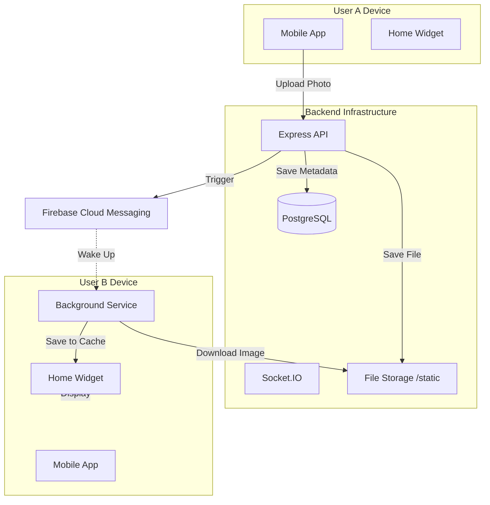

# Pairly 💕
> **Stay connected with your partner, right on your home screen.**


Pairly is a dedicated space for couples to share moments instantly. With a focus on simplicity and intimacy, Pairly lets you send photos directly to your partner's home screen widget, ensuring you never miss a moment together.

## ✨ Key Features
- **📸 Instant Photo Sharing**: Snap and send photos directly to your partner.
- **📱 Home Screen Widget**: Receive photos instantly on your 3x3 Android widget.
- **⚡ Real-time Updates**: Powered by Socket.IO and FCM for sub-second delivery.
- **💾 Offline Support**: Widgets cache photos locally, so they work even without internet.
- **🔒 Private & Secure**: Couples are paired securely; content is shared only between partners.
- **🔋 Battery Efficient**: Optimized background services for minimal impact.

## 🛠️ Tech Stack
**Frontend (Mobile App)**
-   **Framework**: [React Native](https://reactnative.dev/) (Expo)
-   **Language**: TypeScript
-   **Widget**: Native Android (Kotlin/XML)
-   **State/Storage**: AsyncStorage, Context API, Shared Preferences (Android)

**Backend (API)**
-   **Runtime**: [Node.js](https://nodejs.org/)
-   **Framework**: Express.js
-   **Database**: PostgreSQL (via [Prisma ORM](https://www.prisma.io/))
-   **Real-time**: Socket.IO
-   **Notifications**: Firebase Cloud Messaging (FCM)
-   **File Processing**: Sharp (Image compression)

## 🚀 Getting Started

### Prerequisites
-   Node.js (v18+)
-   PostgreSQL Database (Local or Cloud like Render/Supabase)
-   Android Studio (for Emulator) or Physical Android Device
-   Firebase project (for `google-services.json` and Service Account)

### 1. Backend Setup
The backend handles authentication, photo storage, and real-time sockets.

```bash
# Navigate to backend
cd backend

# Install dependencies
npm install

# Configure Environment
# Create .env file and add your keys (DATABASE_URL, CLERK_KEYS, FIREBASE_CREDENTIALS)

# Run Database Migrations
npx prisma generate
npx prisma migrate deploy

# Start Server
npm start
```

### 2. Mobile App Setup
The app requires the backend to be running (locally or deployed).

```bash
# Navigate to app directory
cd Pairly

# Install dependencies
npm install

# Start Metro Bundler
npx expo start --android
```

> **Note**: For the Widget to work, you must run the app as a native build:
> `npx expo run:android`

## 🏗️ Architecture



## 📱 Widget Implementation
The Android widget is built using native **Kotlin** to ensure performance and offline capability.
-   **Layout**: `3x3` grid (resizable).
-   **Update Mechanism**: Uses `BroadcastReceiver` triggered by FCM background messages.
-   **Storage**: Shared Preferences groups allow the React Native app to share file paths with the native Widget.

## 🤝 Contributing
Contributions are welcome! Please fork the repository and submit a Pull Request.

## 📄 License
This project is licensed under the MIT License.

---
*Created with ❤️ for couples everywhere.*
